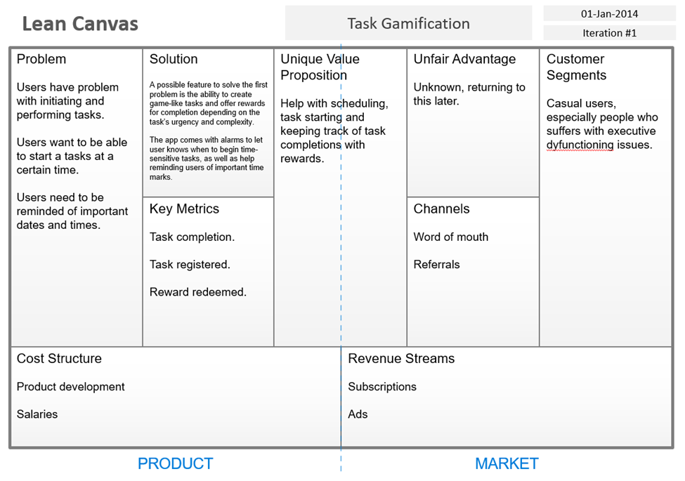
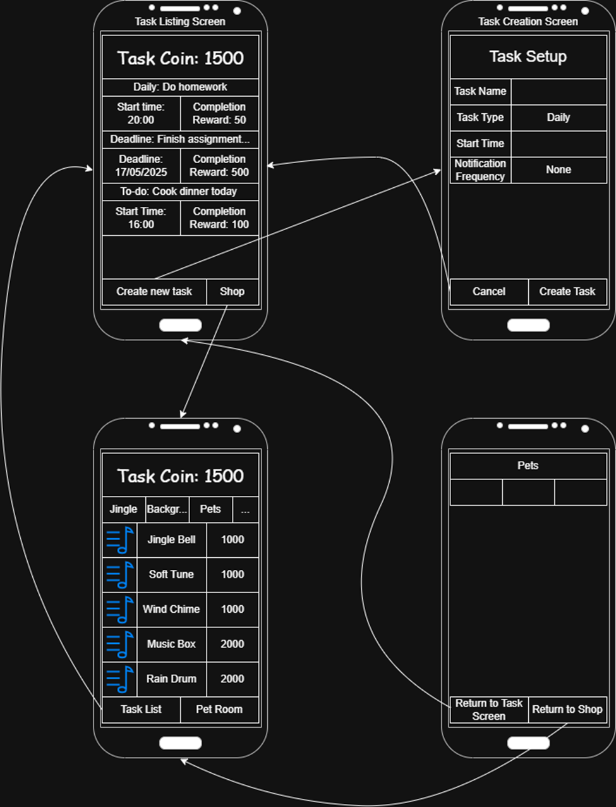

# Task Gamificator - Assignment 1 Phase 2
First of all, I would like to apologize for how late this submission was. The issue around this was because I didn’t have a group. Therefore, the entire project had to be done by myself.  I have made a massive mistake of starting a lot later than usual, and as such, only having 5 days until lab day to present it. If I had more time (if I had remembered to run this assignment earlier), I would have been able to figure out something, but I ended up crunching time and unable to produce something that I can be satisfied with. This ultimately was my fault, and I apologize deeply for it.

The issues that ended up crashing the project entirely was that I couldn’t figure out how to get FlatList to update in time and immediately. Unfortunately, every source of support I found suggested a different solution that does not work with the way the prototype is working at the moment. Because live update to Flatlist or its components were necessary for the implementation of the Task List and Shop listing, it created a cascading problem that ended up breaking everything.

I understand that this submission was inadequate, but at the end of the project at the very least I was able to manage the system for creating and cashing in rewards for tasks. I was not satisfied with this submission myself. But I understand that I cannot take any longer to submit it.

# I. Lean Canvas

# II. Screen list:
1.	Task Setup (Implemented):
-	The user should be able to create a new custom task, as well as the tasks priority and timeframe of when it should be done.
-	Cancelling task creation if the user wants.
-	Setup whether or not they want notifications. How often notifications are and notification messages.
2.	Task Listing (Implemented):
-	List the tasks that the user has to do (or should be started at certain time) with its associated reward in term of in-app currency. Keep track of the user’s in-app currency as well.
-	Allow the user to click on individual task to see the details (time until start time / deadline / next notification).
-	Play animations and jingles upon task completion.
3.	In-app shop (Missing):
-	Allowing the user to exchange the task completion currency for rewards (jingles, backgrounds, in-app pets, etc.)
4.	Pet room (Missing):
-	Uses the things you buy from the in-app shop to take care of your own little Tamagotchi.

# III. Flow Diagram:
