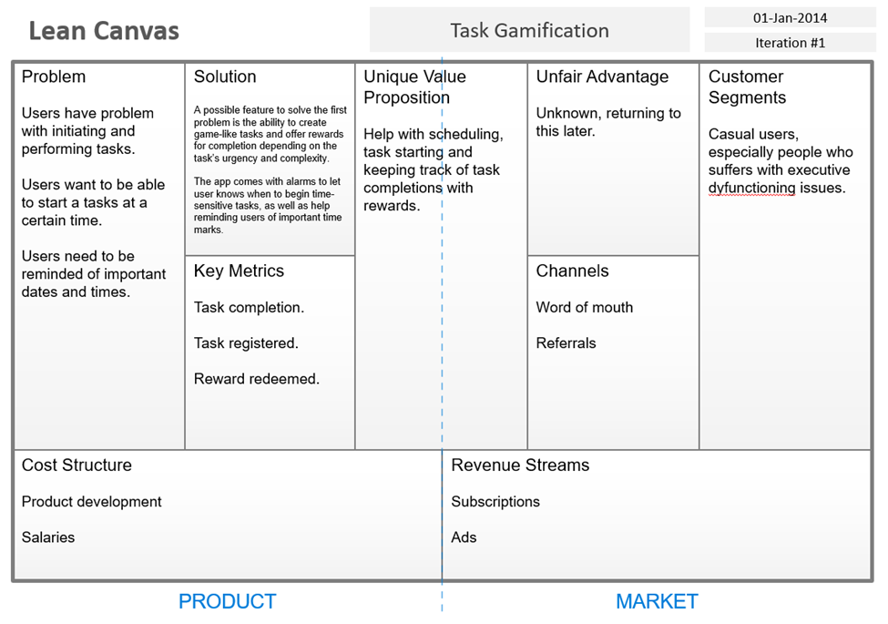
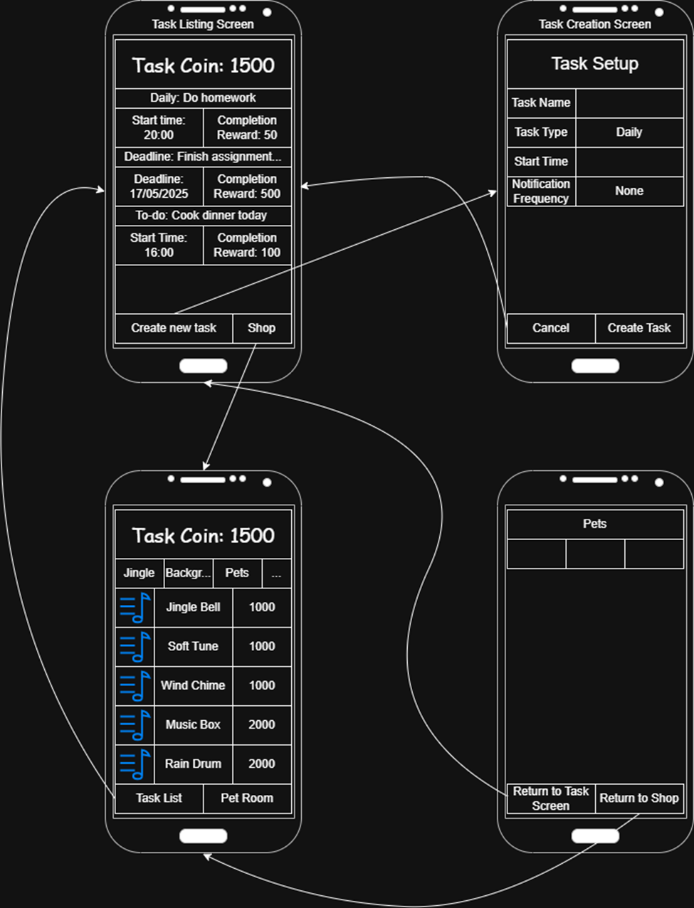

# Task Gamificator - Assignment 1 Phase 2
I am working on this alone, 2 days before deadline, and I'll prolly die but at this point I deserves it :sparkles:

# I. Lean Canvas

# II. Screen list:
1.	Task Setup:
-	The user should be able to create a new custom task, as well as the tasks priority and timeframe of when it should be done.
-	Cancelling task creation if the user wants.
-	Setup whether or not they want notifications. How often notifications are and notification messages.
2.	Task Listing:
-	List the tasks that the user has to do (or should be started at certain time) with its associated reward in term of in-app currency. Keep track of the user’s in-app currency as well.
-	Allow the user to click on individual task to see the details (time until start time / deadline / next notification).
-	Play animations and jingles upon task completion.
3.	In-app shop
-	Allowing the user to exchange the task completion currency for rewards (jingles, backgrounds, in-app pets, etc.
4.	Pet room
-	Uses the things you buy from the in-app shop to take care of your own little Tamagotchi.

# III. Flow Diagram:
